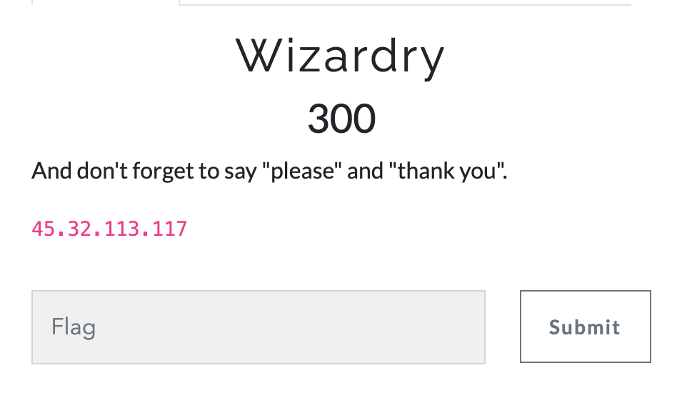
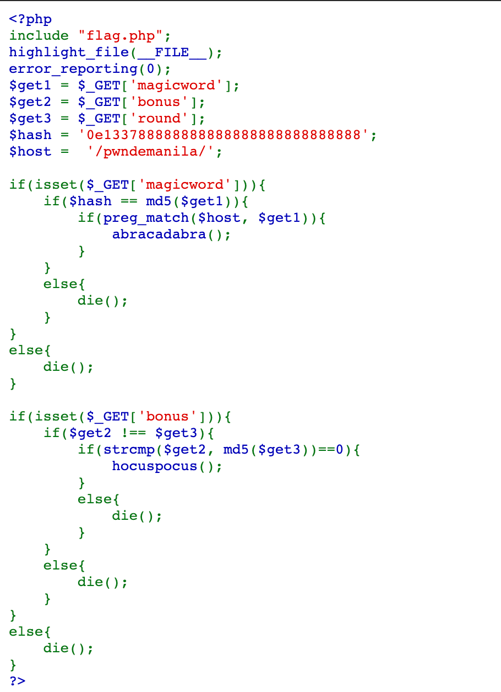
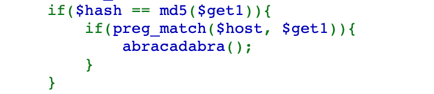
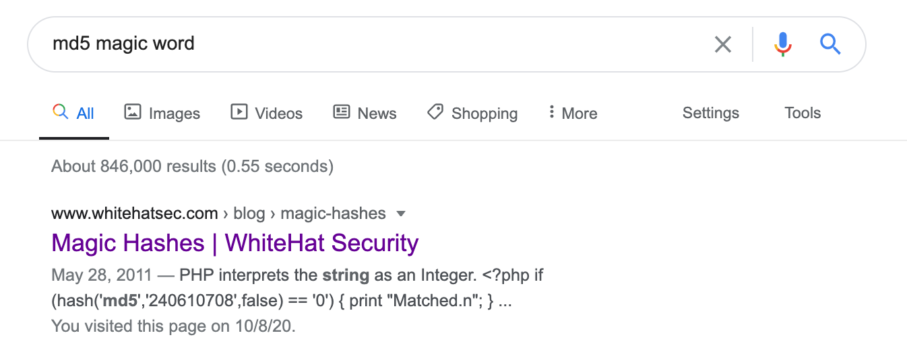
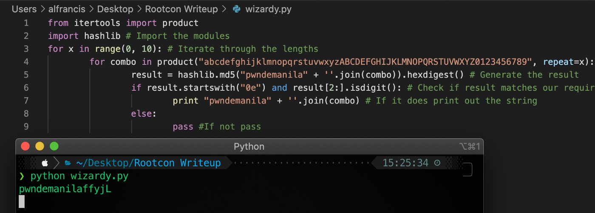
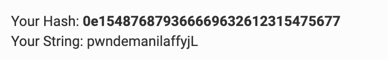
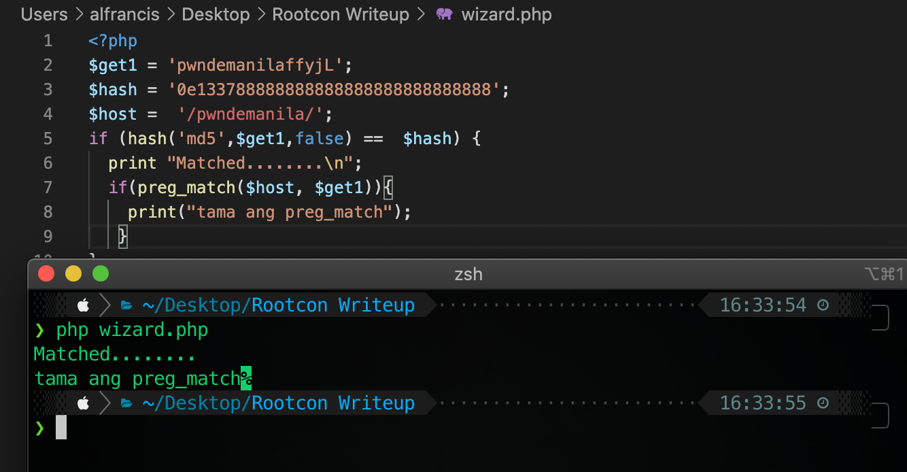

## ROOTCON RECOVERY MODE — CTF Final: Web (Wizardry)

For this post, I will write our team’s solutions for the Web challenge — Wizardry. 

------------------------------------------------------

## Wizardry
### Challenge Writeups

Category: Web

Challenge: Wizardry

Points: 300



The IP address above directed me to the PHP code below.



### Analysis

Line 2 is the inclusion of file flag.phpbut we can't see the source code.

Line 5 to 7 is a GET request accepting 3 parameters magicword , bonusand round

Line 8 to 9 is a static value. (Shoutout to PWN DE MANILA)

**First Condition:**



The condition is a bit confusing at first. It indicates that thehash must equal to the md5 of get1which is from the magicwordparameter. It doesn’t make sense to me, so I have to check more about MD5 hash and by doing so I found a blog about Magic Hashes.



So, this is PHP loose comparison challenge, the vulnerability for this challenge comes into play when there is a loose comparison (==).

```php
<?php

if (hash('md5','240610708',false) == '0') {

  print "Matched.n";

}

if ('0e462097431906509019562988736854' == '0') {

  print "Matched.n";

}

?>
```

I created a PHP script for the initial condition which contain the given hashvalue.


It returns **TRUE!**

But there is an obstacle on the next condition which is preg_match. Even I got the magic hashes for the equivalent of thehashvalue, I need to complete the preg_matchcondition which must include pwndemanilavalue.

My currentmagicword value doesn't work on thepreg_matchcondition. So we need to find a string, that when combined with the host, it returns “0e” + 30 digits because anything that starts with “0e”, followed strictly by only digits will return TRUE.

I use this basic python script:



To verify I get the md5 value of **pwndemanilaffyjL**



We got the string. I can now complete the PHP code.



**Here’s the explanation for the code above:**

Line 5 — $get1 md5 value and $hash value returns TRUE, even not match since it starts with 0e.

Line 7 — $get1 value contains a regular expression from $host value /pwndemanila/ which returns TRUE.

So it seems we have found a valid string **magicword=pwndemanilaffyjL**

**Second Condition:**

Line 25 to 26 is easy, we just need the same value of get2 and md5 of get3. Which are magic hashes that we already used in the example above.

bonus=0e462097431906509019562988736854

round=240610708

Combining all the GET parameter requests we’ll get: http://45.32.113.117/?bonus=0e462097431906509019562988736854&round=240610708&magicword=pwndemanilaffyjL

Voila!!! We get the Flag! (I didn't get the screenshots from the web).

**RC14{m4g1c4ndv1rus3s15ev3rywh3r3h4h4h4h4}**


### Conclusion:
In this challenge, we learn more about Magic hashes and PHP Type Juggling.

For Reference:

Magic Hashes: https://www.whitehatsec.com/blog/magic-hashes/

PHP Type Juggling: https://owasp.org/www-pdf-archive/PHPMagicTricks-TypeJuggling.pdf

Related Challenges: https://hackmd.io/@Chivato/rkj-Y1GVI#COMPARE-THE-PAIR
