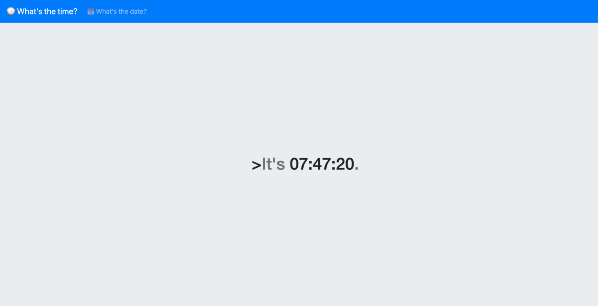
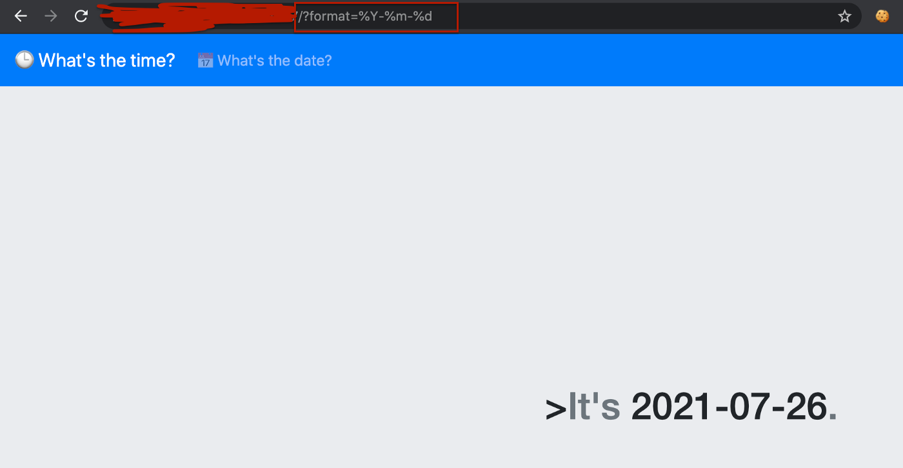
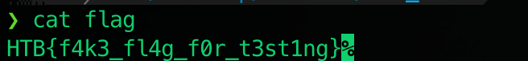
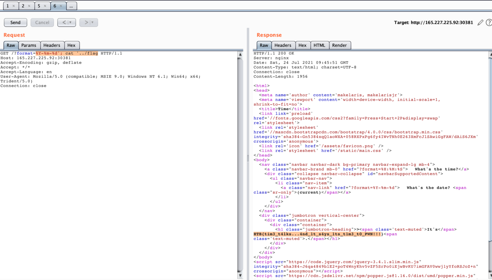
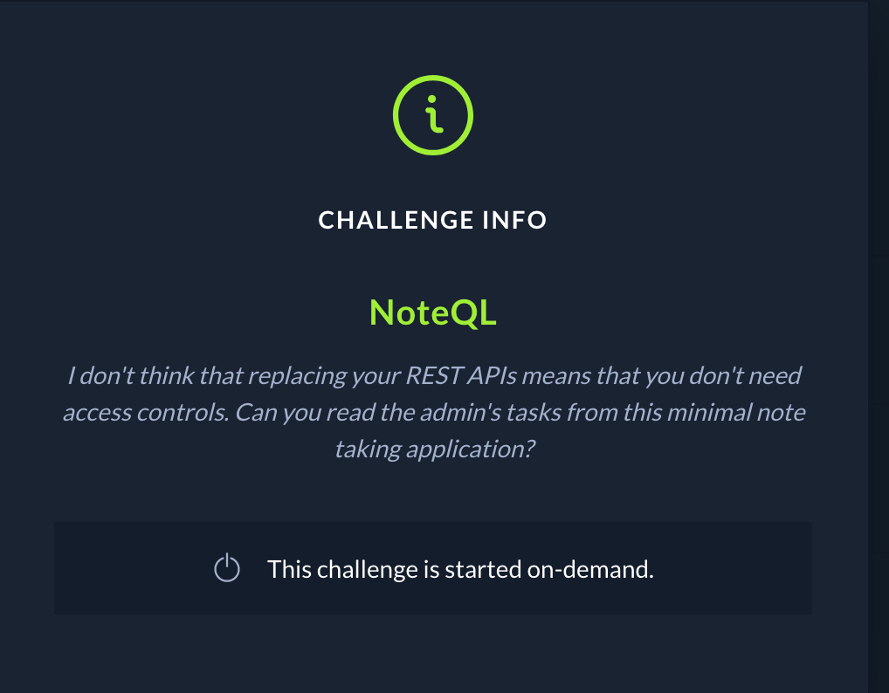
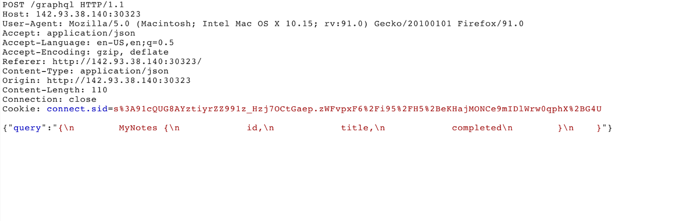
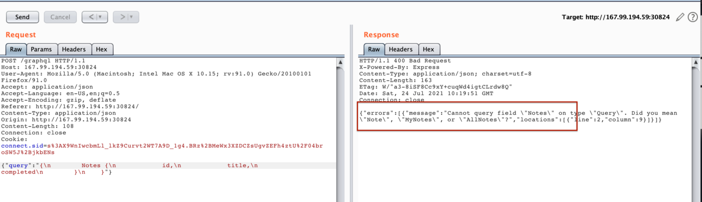
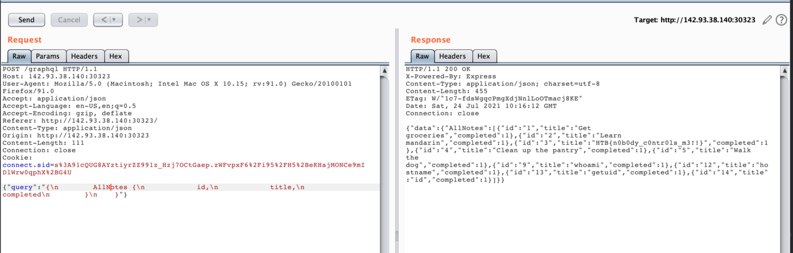

## HTB Business CTF 2021 

Hack The Box (HTB) hosted its very first “corporate only” CTF this past weekend which is called HTB Business CTF 2021. My friend invited me to join their team. So without further ado, let's get into it.


-------------------------------------------------------
#### Web
- [Time](#time)
- [NoteQL](#noteql)


------------------------------------------------------

## Time

Challenge: Time

Category: Web

Get the current date and time, anytime, anywhere!



I notice that it changed when I click the What’s the date? menu.



Since it's a web challenge, I thought of a possible code injection vulnerability.

They provided a source code:

```
web_time
├── build_docker.sh
├── challenge
│   ├── assets
│   │   └── favicon.png
│   ├── controllers
│   │   └── TimeController.php
│   ├── index.php
│   ├── models
│   │   └── TimeModel.php
│   ├── Router.php
│   ├── static
│   │   └── main.css
│   └── views
│       └── index.php
├── config
│   ├── fpm.conf
│   ├── nginx.conf
│   └── supervisord.conf
├── Dockerfile
└── flag
```

First, I checked the directory structure, so it's MVC since we have controller, model, and views folders.
Second, I checked the Dockerfile and build it inside my machine, and examine what is the docker image, command used and where’s the flag located.

```
FROM debian:buster-slim

# Setup user
RUN useradd www

# Install system packeges
RUN apt-get update && apt-get install -y supervisor nginx lsb-release wget

# Add repos
RUN wget -O /etc/apt/trusted.gpg.d/php.gpg https://packages.sury.org/php/apt.gpg
RUN echo "deb https://packages.sury.org/php/ $(lsb_release -sc) main" | tee /etc/apt/sources.list.d/php.list

# Install PHP dependencies
RUN apt update && apt install -y php7.4-fpm

# Configure php-fpm and nginx
COPY config/fpm.conf /etc/php/7.4/fpm/php-fpm.conf
COPY config/supervisord.conf /etc/supervisord.conf
COPY config/nginx.conf /etc/nginx/nginx.conf

# Copy challenge files
COPY challenge /www

# Setup permissions
RUN chown -R www:www /www /var/lib/nginx

# Copy flag
COPY flag /flag

# Expose the port nginx is listening on
EXPOSE 80

# Populate database and start supervisord
CMD /usr/bin/supervisord -c /etc/supervisord.conf
```

I found that the flag is located in /flag path, but they provided a sample flag inside their source code:



Next is I checked controllers/TimeController.php

```php
<?php
class TimeController
{
    public function index($router)
    {
        $format = isset($_GET['format']) ? $_GET['format'] : '%H:%M:%S';
        $time = new TimeModel($format);
        return $router->view('index', ['time' => $time->getTime()]);
    }
}
```

This indicated that the Controller called/created the object TimeModel, so I checked the models/TimeModel.php

```php
<?php
class TimeModel
{
    public function __construct($format)
    {
        $this->command = "date '+" . $format . "' 2>&1";
    }

    public function getTime()
    {
        $time = exec($this->command);
        $res  = isset($time) ? $time : '?';
        return $res;
    }
}
```

I found ```$this->command = “date ‘+” . $format . “‘ 2>&1”;```

This means that we need to inject command (command injection vulnerability)
We can break out the string by adding a single quote (‘) and add a semi-colon(;)

I make an easy request using Burpsuite:

```/?format='; cat ' ../flag```



Gotcha, I found a flag!!!

------------------------------------------------------

## NoteQL

Challenge: NoteQL

Category: Web



The application is a note-taking application that uses GraphQL to save and fetch notes. I forgot to screenshots the main page of the challenge but our goal is to get the Hidden/Admin Notes.

I use Burpsuite to observe the GraphQL request and response.



Default query is:

```{“query” : “{ MyNotes {id, title, completed}}”}```

I tried to change the MyNotes to Notes (guess), but I found an interesting response. Notes do not exist, but the response suggests other Notes, such as **Note, MyNotes, and AllNotes.**



I change the query into **AllNotes**, then I found the flag at **id:3, title: HTB{n0b0dy_c0ntr0ls_m3!!}**

