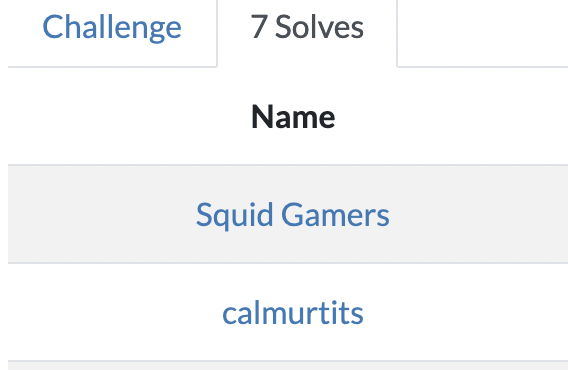
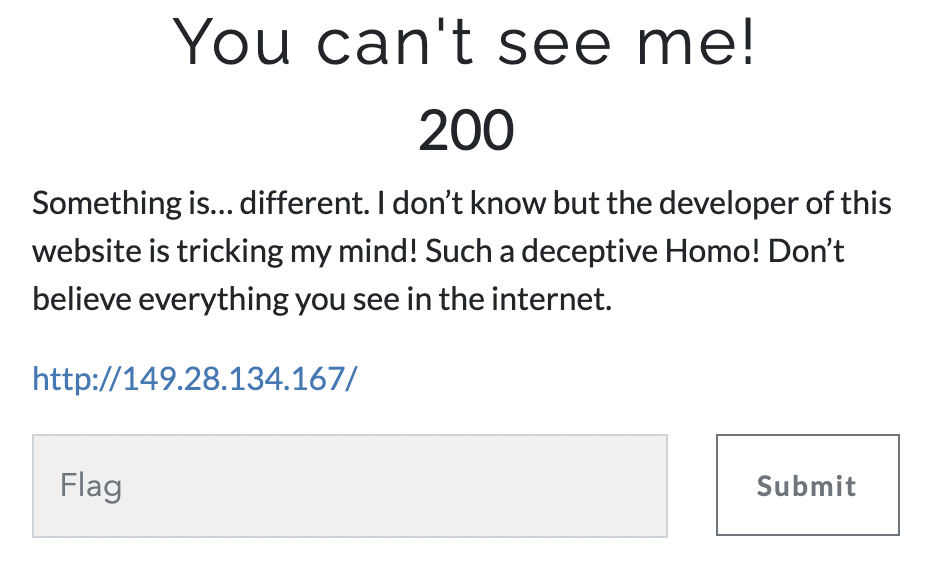
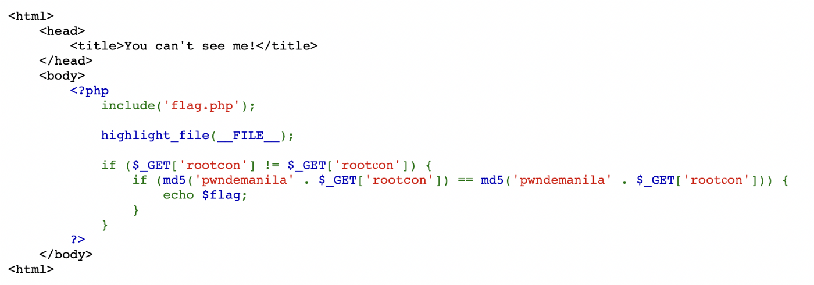
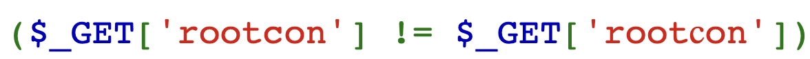
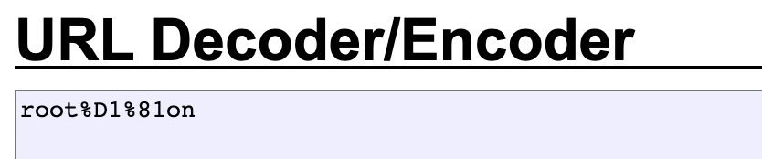
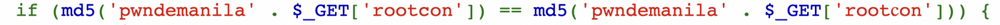
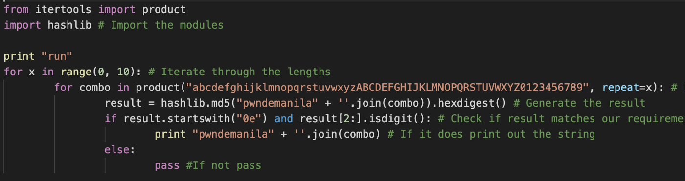
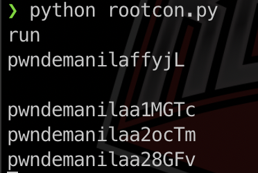
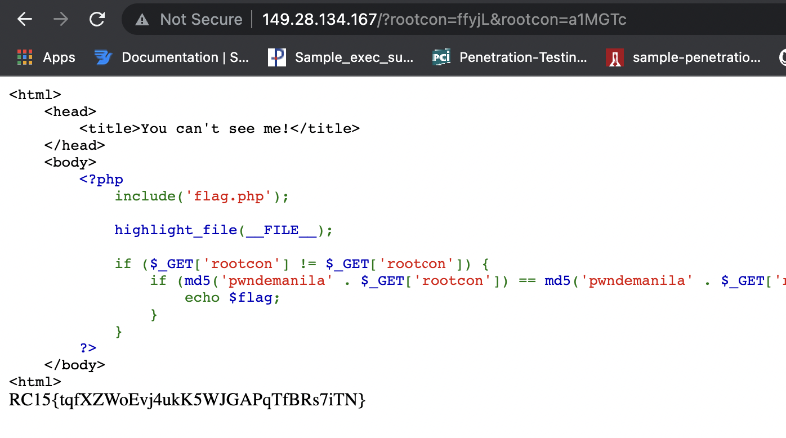

## ROOTCON 15 Capture The Flag

I’m back to ROOTCON CTF! This time with a new team which we called Squid Gamers. Yes, we joined the hype! Special thanks to my teammates, Cyber3n, and Zem3ck1s for doing their best during their free time solving the challenges. Though we didn’t win CTF we still get to enjoy the game and learn a lot which is for me is still a win. Plus a bonus real win for getting the top score in Hacker Jeopardy which gives us our first Black Badge. Not bad for first time in Rootcon HJ. And we also made the goons drink so much!

Before I totally lost focus, let me go back on the CTF Web challenge — 200 points. Just like with my previous writeup from last year's event, during Rootcon Recovery Mode, I’ll walk through the steps I did to solve the challenge, which turns out to be the first blood of the game.

-------------------------------------------------------
#### Web
- [Web 200: You can't see me!](#web200)

------------------------------------------------------

## Web200

Let's Go!!

Challenge Writeups

Category: Web

Challenge: You can’t see me!

Points: 200

The IP address above directed me to the PHP code below.

### Analysis
LINE 7 is the inclusion of the file flag.phpbut we can't see the source code.

LINE 11 is to GET request accepting 2 parameters. If you look closely the font used for the letter C in rootcon is different in the 2nd get request. The condition tells us that these 2 parameters should not be equal.

I manually copied the word and verified it using URL decoding.

Now we have our URL without a value:

http://149.28.134.167/?rootcon=&root%D1%81on=

Let’s analyze the next line, which is LINE 12, which indicates that the 2 md5hash must be equal.

It reminds me of my previous writeup for Rootcon Recovery Mode last year about magic hash. You may check it from this link below [https://laet4x.medium.com/rootcon-recovery-mode-ctf-final-web-wizardry-1419d664eedf](https://laet4x.medium.com/rootcon-recovery-mode-ctf-final-web-wizardry-1419d664eedf).

So I decided to reuse the script. Basically, this script will find word/s to combine with the word ‘pwndemanila’, which in return will results in “0e” + 30 digits MD5 hash.

After several minutes I got the results:

Solution:
pwndemanilaaffyjL = 0e154876879366669632612315475677

pwndemanilaa1MGTc = 0e660685420749161809595800684366

Anything that starts with “0e”, followed strictly by only digits will return TRUE, which makes LINE 12 TRUE.

This is also what we need in LINE 11 since we remove the ‘pwndemanila’ we got pffyjL and a1MGtc and make LINE 11 TRUE.

I crafted our final URL and we Got the flag:

http://149.28.134.167/?rootcon=ffyjL&root%D1%81on=a1MGTc

Special Thanks!

I would like to thanks pwndemanila and rootcon for the exciting challenges in this year’s Capture The Flag. Shoutout to our another team, SOCTEAM CTF for the support. See you next year!!!

https://www.rootcon.org/

https://twitter.com/rootconph

https://www.facebook.com/rootcon/