## HackTheBox Cyber Apocalypse 2022 Intergalactic Chase

I’m back to HTB! This time with a new team which we called HackinKaNalang. Despite of our busy schedule we play this year Cyber Apocalypse CTF

-------------------------------------------------------
#### Web
- [Web 300 : Kryptos Support ](#kryptos_support)
- [Web 300 : BlinkerFluids ](#blinkerfluids)

------------------------------------------------------
## Kryptos_Support
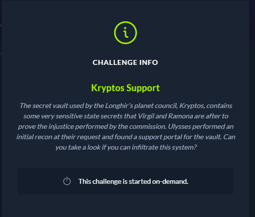

During my enumeration we got a field which you can submit via form and another page which is login portal, 

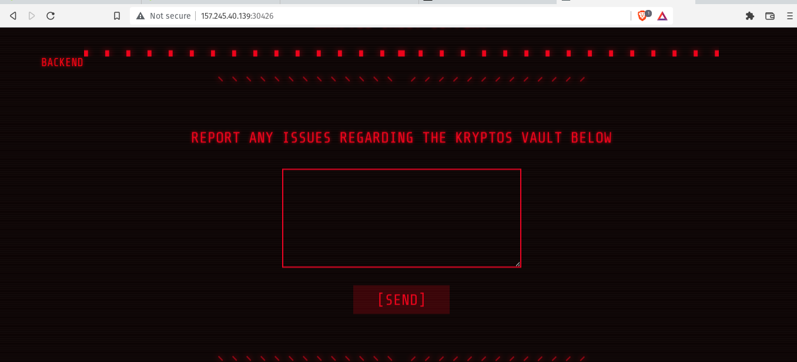

I submit a test content and we got this:

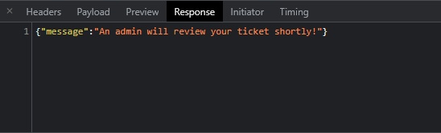

The message above give me a hint of possible XSS attack that we able to get an Admin Cookies/Session, I sent a crafted xss payload to get the admin cookies using https://webhook.site. 

```
<script>
document.write('');
</script>
```

Now i have the session cookies. 

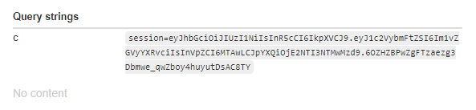

I install a cookie editor to use the session came from the results of my XSS attack.

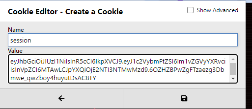

Then I redirected to the admin panel and I dont see any field or upload files, just the ticket that I submitted.

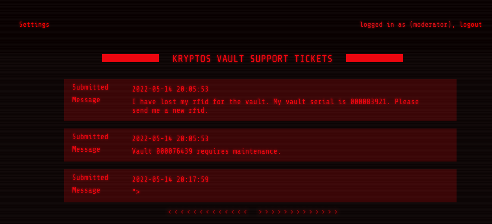

I check the links and I found a change password field. I tried to change the password of the current account and I notice that the account that I compromised is a moderator.

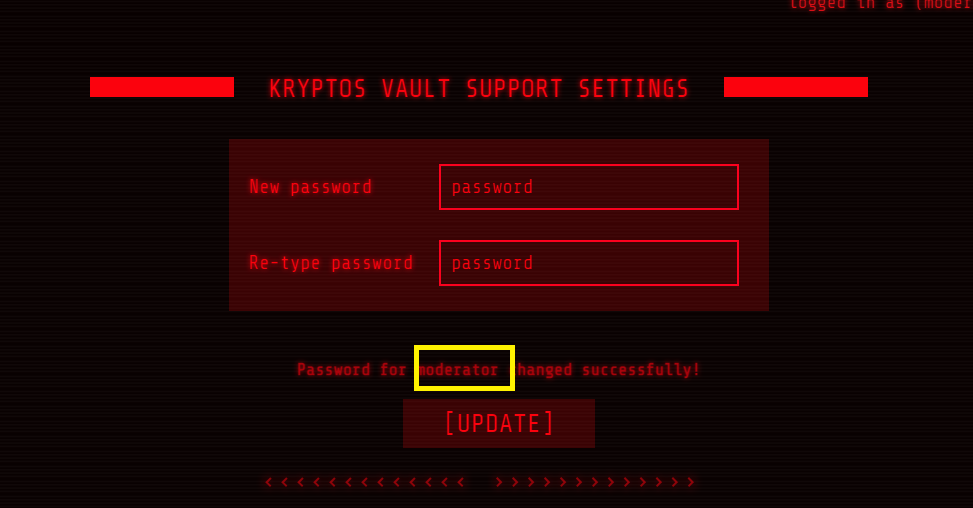

Im thinking that there is an Admin account for this application.
I enable the inspect element functions of browser to check a hidden fields, then I found a UID.

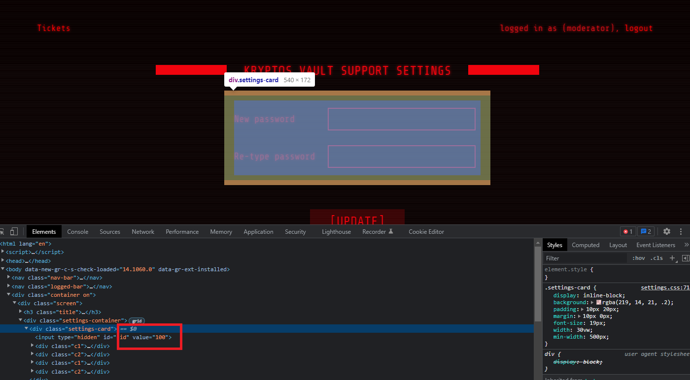

I decided to edit the value to 1 and supplied my chosen password and click submit, then I  got this message

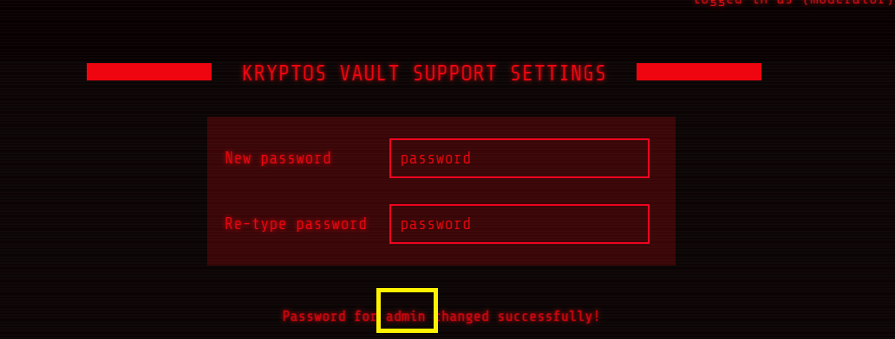

I login using admin and my chosen password and automatically redirected to Home Page with a Flag

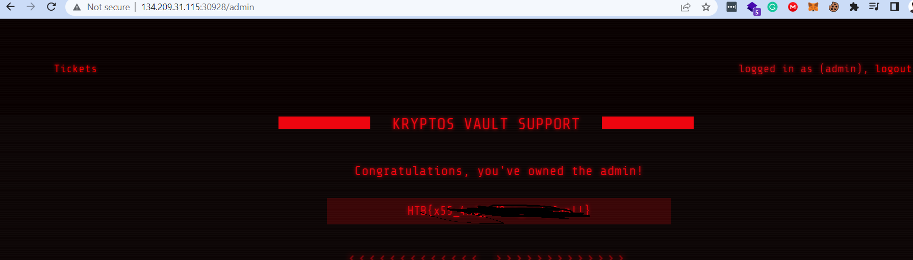

Conclusion: We able to get the flag since the application are vulnerable to Persistent XSS and IDOR or known as Insicure Direct Object Reference
------------------------------------------------------


------------------------------------------------------
## BlinkerFluids


The challenge contains of web app and a source code.
The page contains of markdown editor and after submission it convert the text to pdf.

I review the source code and its node.js so basically i check the packages.json for possible vulnerable packages, and i notice the md-to-pdf package.

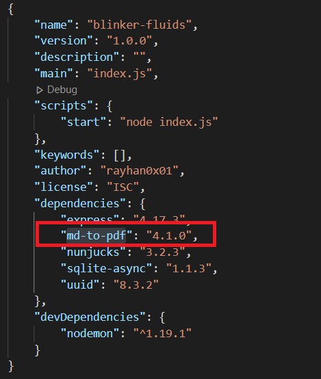

I search of possible exploit and i found RCE on snyk.io : https://security.snyk.io/vuln/SNYK-JS-MDTOPDF-1657880

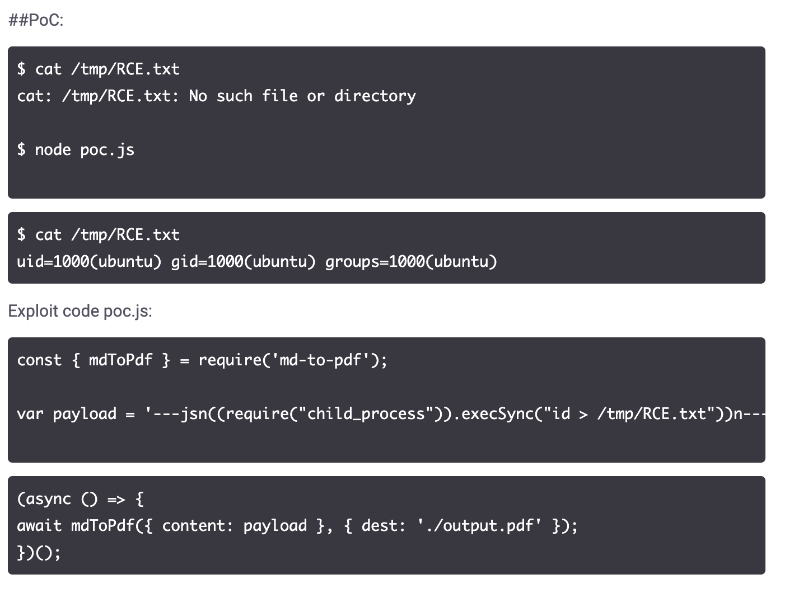

I check the github issues and found interested comment

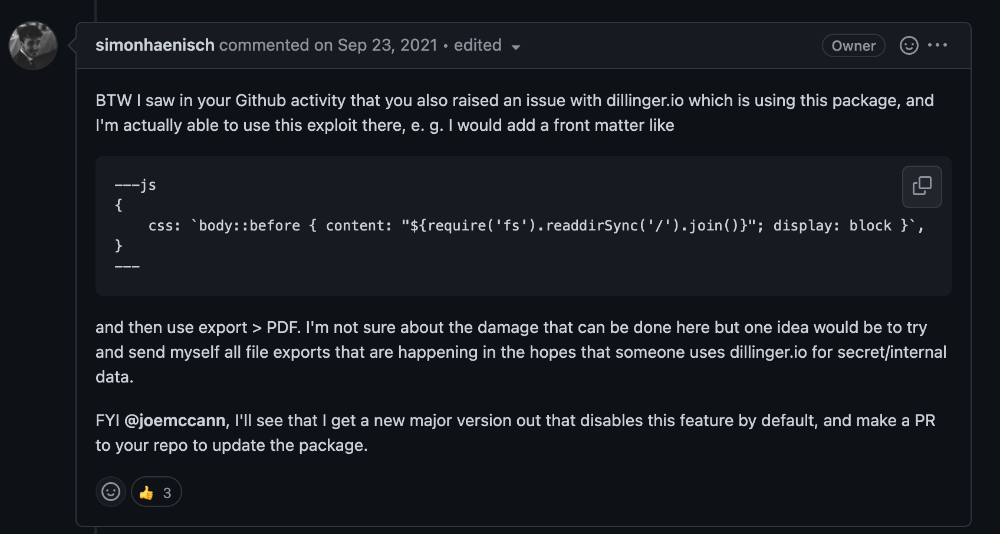

I created a RCE code and supplied it to the markdown editor and I click submit

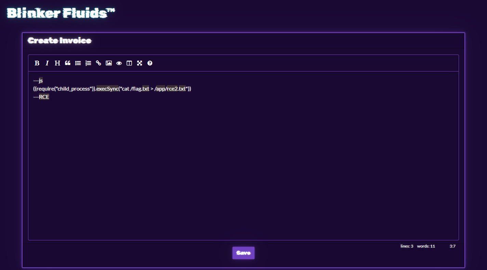

I created another markdown to check if the rce2.txt is created, and it listed all the files which the rce2.txt has been created

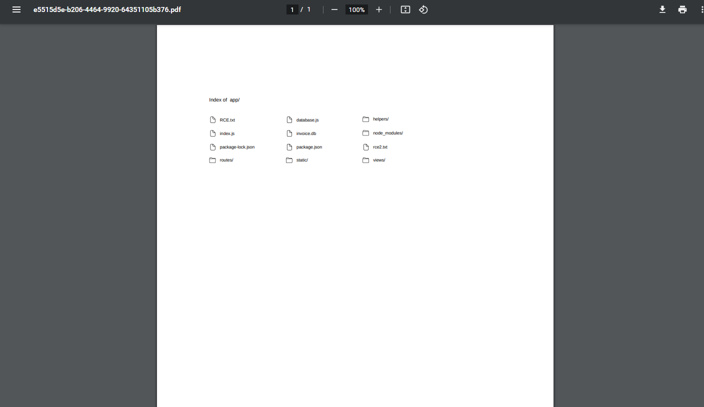

I created a final markdown content to read the rce2.txt, then i got the flag.

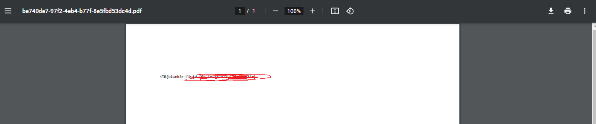

Conclusion: We able to get the flag by using package vulnerabilities, what i learn here is the importance of the source code review.
------------------------------------------------------